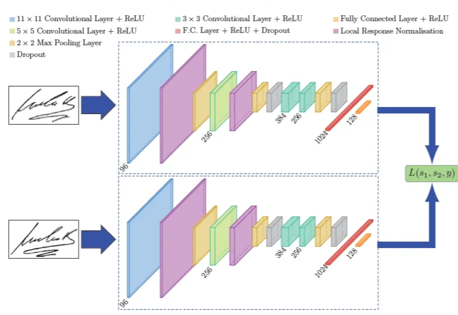

# Siamese Neural Networks for One-shot Image Recognition

This repository provides a reimplementation from scratch of a **Siamese Neural Network (SNN)** for **One-shot Image Recognition** using the **Faces in the Wild** dataset. The approach is based on the foundational paper by Koch, Zemel, and Salakhutdinov, leveraging deep metric learning to address the challenges of one-shot learning tasks.
- **Paper Link**: [Paper](https://www.cs.cmu.edu/~rsalakhu/papers/oneshot1.pdf)



## Overview

One-shot learning enables accurate predictions from a single training example for each class. This project uses Siamese Neural Networks to differentiate between pairs of images, aiming to replicate the human ability to learn new concepts rapidly and recognize their variations. This repository demonstrates the SNN’s capabilities in facial recognition by learning discriminative features that generalize well even to previously unseen classes.

## Key Features

- **Siamese Architecture**: Twin convolutional networks that share weights to learn similarity between images by embedding them in a feature space where distance represents similarity.
- **Contrastive Loss**: The model uses contrastive loss to minimize the distance between similar pairs and maximize it for dissimilar ones.
- **Faces in the Wild Dataset**: A diverse dataset for training and evaluating the model on real-world, unconstrained images.

## Dataset

- **Dataset Source**: [Faces in the Wild](http://vis-www.cs.umass.edu/lfw/)
- **Usage**: Organized as pairs for training on similarity verification and one-shot classification tasks.

## Model Architecture

The Siamese network consists of two identical subnetworks with shared weights, each with a series of convolutional layers followed by fully connected layers to map images into an embedding space. This structure enables the model to effectively evaluate the similarity between pairs of images based on their learned embeddings.

### Architecture Details
- **Convolutional Layers**: Extract spatial features, followed by rectified linear units (ReLU) for non-linearity.
- **Fully Connected Layers**: Map the convolutional output to a compact feature space.
- **Distance Metric**: The L1 distance between embeddings, with a final sigmoid layer for binary classification.

## Approach

The model is trained to solve a verification task: learning to identify if pairs of images belong to the same class. This verification approach then generalizes to one-shot tasks by evaluating similarity between a test image and a single example from each new class. The model selects the class with the highest similarity, enabling accurate one-shot classification.

```bash
git clone https://github.com/yourusername/siamese-network-one-shot.git
cd siamese-network-one-shot
pip install -r requirements.txt
